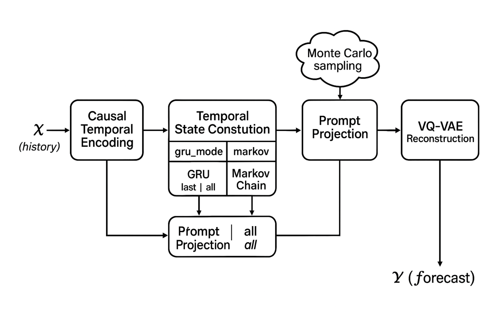

# Markov-LLM: Probabilistic Time-Series Forecasting via Patch-VQ Autoregression
| [:mortar_board: Introduction](#mortar_board-introduction) | [:rocket: Quick Start](#rocket-quick-start) | [:school_satchel: Dataset](#school_satchel-dataset) |
[:exclamation: Acknowledgement](#exclamation-acknowledgement) |

## :page_with_curl: License
MIT license

## :mortar_board: Introduction
In this work, we propose **Markov\_LLM**, a time-series forecasting framework with frozen LLM, which builds a **markov chain** of states within input history context to preserve temporal information loss, and leverage the LLM as a **probabilistic auto-regressive** engine via **patching** and **VQ-VAE** style tokenization for the LLM output. The main contribution in this work are:

- This framework introduces a key strategy, building a markov chain on the long context history input, and use the last state for a sufficient-state alignment  to preserve temporal information loss, caused by self-attention during forecasting with LLMs. 
- This framework utilizes patching and VQ-VAE codebook, to do a patch-level tokenization for the LLM output, followed by an auto regression, sampling from learned token distribution. This strategy is designed to map the nature of LLM token generation: probabilistic distribution based autoregression, and capture uncertainty while preserving local temporal relations by patching, help to make a good prediction on both target points and distribution.

<p align="center">

</p>

Our framework consists of five core components:
1. **Causal Temporal Encoding**: Extracts rich temporal features while preserving causal ordering.
2. **Temporal State Construction**: Builds compressed representations of temporal dependencies. We have two modes here: GRU mode and Markov mode.
3. **Prompt Projection**: Maps temporal states to LLM input space.
4. **Probabilistic-based Autoregressive Generation**: Leverages frozen LLM for token generation.
5. **VQ-VAE Reconstruction**: Converts discrete tokens to continuous time series predictions.

## :rocket: Quick Start
### Requirements
transformers==4.56.0 \
accelerate==1.10.1 \
einops==0.8.1 \
pandas==2.2.2 \
scikit-learn==1.6.1

For **Mac OS**: \
torch==2.2.2 \
platform_system == "Darwin"

**Linux & Windows** : \
--extra-index-url https://download.pytorch.org/whl/cu126 \
torch==2.8.0+cu126 \
platform_system == "Linux" and platform_machine == "x86_64"

To install all dependencies:
```
pip install -r requirements.txt
```

### Quick Demo
Feel free to edit the script file for experiments. For example, we run a default experiment on ETTh1 dataset:
```
bash ./script/markov_llm_ETTh1.sh
```

## :school_satchel: Dataset
The dataset files are inside the folder "dataset", we mainly used **Hourly Electricity Transformer Temperature dataset (ETTh1)**, which includes 17420 rows of hourly data with 7 variables:
- High useful load (HUFL) 
- High useless load (HULL) 
- Middle useful load (MUFL) 
- Middle useless load (MULL)  
- Low useful load (LUFL) 
- Low useless load (LULL) 
- Oil Temperature (OT).

## :exclamation: Acknowledgement
The core motivation of our work is inspired by [DLinear](https://github.com/vivva/DLinear). And our framework is inspired by [Time-LLM](https://github.com/KimMeen/Time-LLM), with same dataset and LLM configuration (GPT2).
